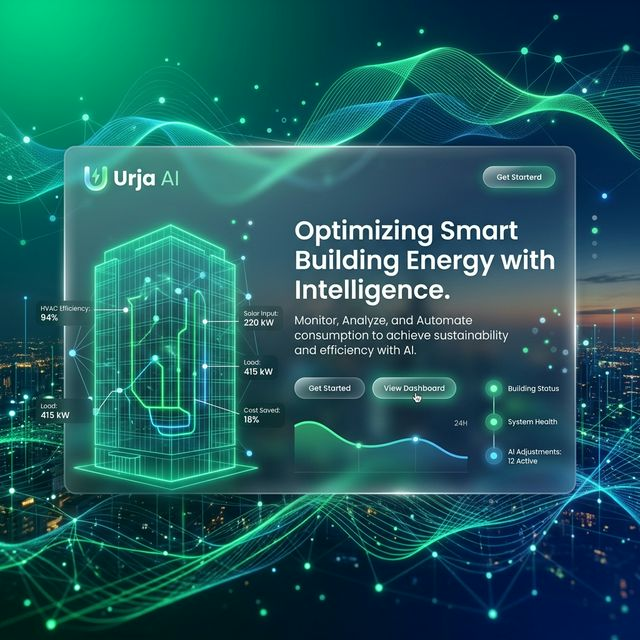

# ⚡ Urja AI — Campus Energy Intelligence

<div align="center">
  
</div>

---

**Urja AI** is a state-of-the-art campus energy optimization platform that combines deep machine learning, RAG (Retrieval-Augmented Generation), and real-time building data to minimize energy waste and maximize peak-demand efficiency.

### 🌟 Key Features

*   **🧠 RAG-Powered Recommendation AI**: Chat with your building! Understand the *why* and *how* of every energy-saving recommendation via an integrated RAG pipeline.
*   **🌍 Carbon Impact Tracker**: Live calculation of your environmental footprint, from CO₂ avoided to equivalent trees planted.
*   **⚡ Peak Demand Optimization**: Smart load-shifting strategies based on local energy pricing tariffs and real-time occupancy.
*   **🔮 24-Hour Energy Forecast**: High-accuracy predictive modeling using weather-aware TabTransformer architectures.
*   **🏥 Multi-Building Management**: Centralized intelligence across Administrative, Library, and Academic blocks.

---

## 🚀 Quick Start

### 1️⃣ Backend (FastAPI)
```bash
cd backend
python -m pip install -r requirements.txt
python seed_users.py          # Create admin/viewer accounts
python -m uvicorn app.main:app --port 8000
```
*   **API**: [http://localhost:8000](http://localhost:8000)
*   **Docs**: [http://localhost:8000/docs](http://localhost:8000/docs)

### 2️⃣ Frontend (Vite + React)
```bash
cd frontend
npm install
npm run dev
```
*   **Dashboard**: [http://localhost:5173](http://localhost:5173)

---

## 🔐 Default Credentials

| Role | Username | Password |
| :--- | :--- | :--- |
| **Admin** | `admin` | `urjaai123` |
| **Viewer** | `viewer` | `urjaai456` |

> [!IMPORTANT]
> Please rotate these credentials via the `/auth/reset` endpoint (or database management) before public deployment.

---

## 🏛️ Project Architecture

```text
UrjaAI/
├── backend/
│   ├── app/
│   │   ├── routers/             # Consolidated /rag, /enhanced, /predict endpoints
│   │   ├── services/            # Core logic (RAG Service, ML models, Scheduler)
│   │   └── models/              # SQLAlchemy (Users, SensorReadings)
│   └── data/                    # Historical and RAG knowledge base
└── frontend/
    ├── src/
    │   ├── pages/               # Dashboard, Deep & Enhanced Recommendations
    │   ├── components/          # Glassmorphic UI & Carbon Trackers
    │   └── services/            # Axios API layer with Token Interceptors
```

---

## 🌐 Deploying to v0

To host the frontend on **v0**, follow these steps:

1.  **Export Components**: Ensure all components in `frontend/src/components` are clean and isolated.
2.  **Vite Build**: Run `npm run build` to generate the production `dist/` folder.
3.  **v0 Import**: Upload the `frontend/` directory to your v0 project.
4.  **API Connection**: Set the `VITE_API_BASE_URL` environment variable in the v0 dashboard to point to your hosted backend (e.g., `https://your-api.railway.app`).

---

## 🛠️ Tech Stack

*   **Frontend**: React 18, Vite, Tailwind CSS, Recharts, Framer Motion.
*   **Backend**: FastAPI, SQLAlchemy, APScheduler, Python-Jose (JWT).
*   **AI/ML**: FAISS (Vector Store), SentenceTransformers (RAG), SHAP (Explainability).

---

<div align="center">
  <p>Built for a Sustainable Campus Future</p>
  <sub>Urja AI · Energy Optimization System · 2026</sub>
</div>
